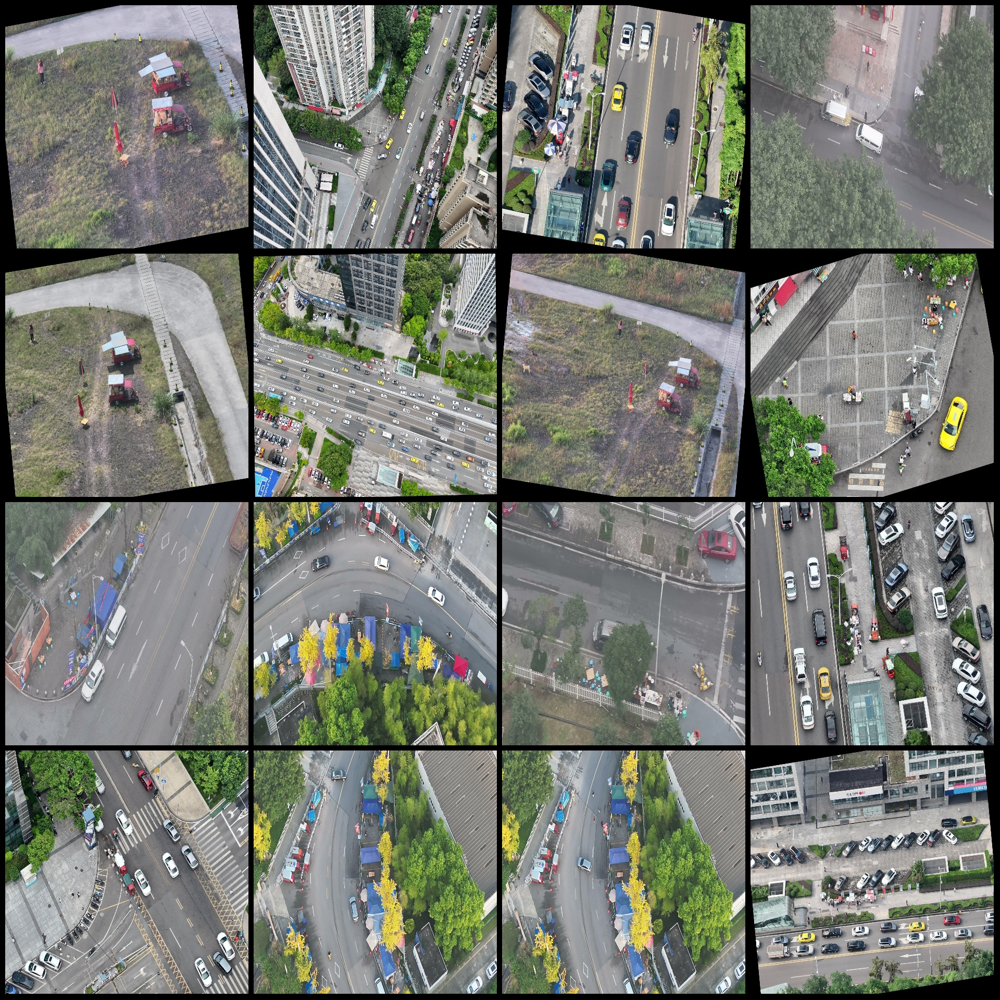
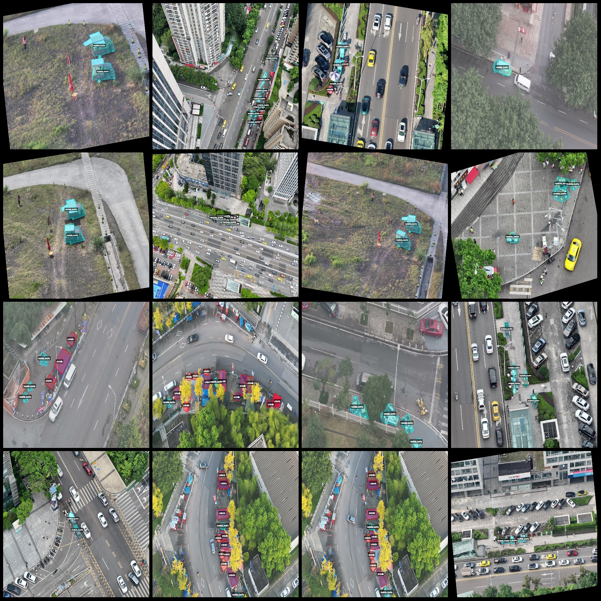
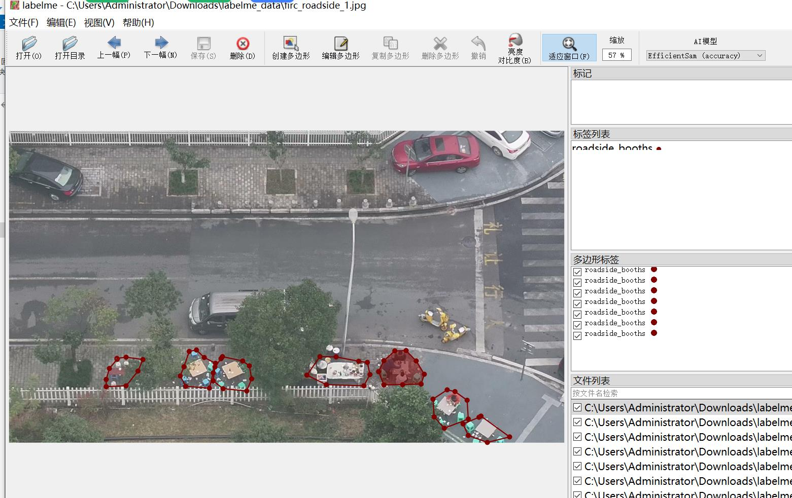

# Drone Perspective Urban Street Sidewalk Business Identification and Segmentation Dataset (labelme format, 359 images in 2 categories)

Please note that some of the enhanced images in the dataset mainly include rotation enhancements.
The dataset is formatted as labelme without a mask file, containing only JPG images and their corresponding JSON files.
There are 355 JPG files.
There are 355 JSON files.
There are 2 categories of annotations: "roadside_booths" and "umbrella".
Each category has annotated bounding boxes:
- Roadside booths (sidewalk business): count = 1453
- Umbrella: count = 655
Total bounding box count: 2108
Annotation tool used: labelme v5.5.0
Image resolution: 1920x1080
Annotation rules: polygon is drawn around the category.
Special notice: The dataset can be opened and edited using labelme; however, the JSON dataset must be converted into either YOLOF, COCO, or instance segmentation format for semantic segmentation or 
instance segmentation tasks.
Special declaration: This dataset does not guarantee the accuracy of the trained model or weight files.
Sample image preview:
Annotation example:
Randomly selected 16 images:
Annotation drawing results:
Labelme editing example image:

## Images

Here is a pay link on Stripe ( https://buy.stripe.com/3cs8yP7sY87d0vu9AB ). Please contact me lonlonago@foxmail.com after funding $89, and I will send you a complete data files , thank you!

